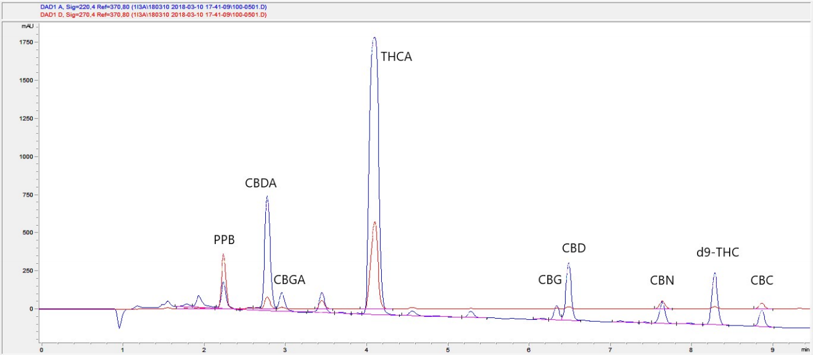

|  |
|           :---:             |
| **Confidence Analytics**    |
| 14797 NE 95th ST            | 
| Redmond, WA 98052           |
| (206) 743-8843              |
| info@conflabs.com           |
| www.conflabs.com            |

# Eight Cannabinoids by HPLC-UV
A Method Application Note on the detection of 8 Cannabinoids using HPLC-UV.  
**by Confidence Analytics** 

## Overview  

Measurement of cannabinoid content, or “the potency test”, is the most frequently discussed method in cannabis
analysis. Many such methods have been developed in the past few years, but at the me of this wring no published
cannabinoid method has been rigorously validated and shown to work consistently with real cannabis samples of all
types. Consequently, cannabis labs are developing their own methods to measure cannabinoid content in consumer
products. Some of these methods are loosely based on the guidelines of the American Herbal Pharmacopoeia’s Cannabis
Inflorescence monograph, which briefly describes a method developed by Debaker et al. (2009) and adapted by Swi et
al. (2013). Still other cannabis labs are using methods developed by equipment manufacturers and chemical suppliers.

In this paper we describe the method used by Confidence Analytics routinely since 2014, which is based on the work of
Swi et al. (2013). We include example instructions for sample preparation -- including our recommended means of
homogenizing flower samples -- instrument requirements and method performance, important considerations, and an
overview of our experience using this method for years.

A recent publication by Jikomes and Zoorob (2018) reviewed the laboratory outcomes of 6 leading cannabis laboratories
in Washington state and highlighted the need for standardization between them. That research found the data reported
by Confidence Analytics -- generated with the method described here -- closely agrees with previous research outside
the context of compliance testing. The study discusses the value in consistent analytical sensitivity for relatively low
levels of CBDA and CBD, with data graphics showing that this method also performs well in that context.

## Performance Specifications  

This method uses an HP/Agilent LC 1100 equipped with a quarternary pump, 100-well vial autosampler, column oven,
and Diode Array Detector. This instrument was selected because it is cheap, reliable, easy to maintain, and of sufficient
performance for adequate cannabinoid analysis.

|||
| :---                              | :---                                                        |
| Cycle me (per sample)             | <12.5 minutes                                               |
| Linear Dynamic Range (standards)  | 0.4 ug/mL – 50 ug/mL, up to 1000 ug/mL*                     |
| LC Solvent Use per 1000 samples   | 4.85 L HPLC-grade water, 13.7 L HPLC-grade acetonitrile     |
| Column Lifetime                   | \>2000 injections**                                         |
| Wavelengths Monitored             | 220 nm, 270 nm                                              |
| Analytes Measured (elution order) | CBDA*, CBGA, THCA*, CBG, CBD*, CBN, THC (delta-9)*, CBC     |
| Sample Reporting Range (% w/w)    | 0.1% to 100%*                                               |
| Sample Types Analyzed             | Green plant matter, concentrate, marijuana-infused products |

**Table 1**: some select method performance specifications  

###### *some analytes have a broader calibration range due to their greater abundance in real samples  

###### **no guard column used for RT stability, depends on number of non-inhalable samples injected

## Method Technical Parameters

**HP/Agilent LC 1100 system:**  
- Inline Degasser (G1322A, G1379A, or equivalent)
- Quarternary Pump (G1311A or equivalent)
- Autosampler (G1313A or equivalent) fied with 50 uL sample loop
- Column Compartment (G1316A or equivalent)
- Diode Array Detector (G1315A or equivalent)

**Solvent Gradient:**  
- 20% B Start (0 minutes)
- 90% B 8.5 minutes
- 20% B 10 minutes

|||
| :---                    | :---                                                                  |
| Column:                 | Agilent ZORBAX TC-C18(2), 150 x 4.6 mm, 5 um fully porous particles   |
| Column Temperature:     | 35C                                                                   |
| Mobile Phase A:         | 25 mM ammonium formate in 50:50 water and acetonitrile, HPLC-grade    |
| Mobile Phase B:         | neat acetonitrile, HPLC-grade                                         |
| Flow Rate:              | 1.5 mL/min                                                            |
| Expected back-pressure: | 80 - 100 bar (initial parameters)                                     |
| Injection Volume:       | 50 uL                                                                 |
| Measurement Time:       | 9.5 minutes                                                           |
| Post-me:                | 1.7 minutes                                                           |
| Measured Wavelengths:   | 220 nm, 270 nm (4 nm band), ref. 370 nm (80 nm band), Slit Width 4 nm |
| Measured Spectra:       | 190 nm to 700 nm, step 0.5 nm                                         |

**Figure 1:** Typical LC chromatogram of a qualitative retention time standard. This is a real sample solution spiked with
reference standards. The column Peaks are annotated where they match target analytes; note that not all peaks are
known analytes.

## Background and Discussion

### Analyte Selection  

Of the 8 analytes listed in Table 1, some are required by law to be part of the cannabinoid analysis. The analytes cited in
Washington state regulations are CBDA, CBD, THCA, and THC (both assumed as delta-9). We call these “the Big 4”
cannabinoids, so named because most other analytes aren’t usually present in samples at concentrations exceeding 5%
w/w. CBGA is relevant because it is the enzyme substrate for THCA and CBDA biosynthesis, and CBGA content may have
value to farmers and processors in optimizing harvest. CBG, the decarboxylated “neutral version” of CBGA is also present
in cannabis products. Because of the many chemical similarities between CBGA and CBDA (and CBD/CBG), the
chromatographer must be careful to resolve them to avoid over-reporting of CBDA content where CBGA is present in
abundance. These three “acid/neutral pairs” for CBDA/CBD, THCA/THC, and CBGA/CBG are the most important
cannabinoids to measure in cannabis products intended for inhalation. Additionally, CBN is useful to measure as it is a
known degradation product of THC – and therefore a quality marker – and seems to modify pharmacological acvity of
cannabis materials. CBC is the last compound to elute on this method, and is convenient to add to calibrations because
its CRM standards are cheap, and making sure CBC elutes in the acquisition window is useful for determining system
suitability. Other cannabinoids may elute with resolution on this method.

### Sample Preparation  

Cannabis flower samples need to be homogenized in a way that preserves cannabinoid content and minimizes any
fractionation of trichome parts from the rest of the green plant matter. Mortar and pestle, blender, and herb grinder --
before or aer drying -- have all been experimented with as methods of homogenization. No method of cannabis flower
homogenization has been found to work as well as frozen ball-milling for its ability to produce uniform particle size
without static-charge tendency. Concentrates are easier to homogenize, and many such samples are presented in a
homogeneous form. As with marijuana-infused products, the appropriate means of homogenizaon depends on the
sample itself.  

### Calibration Standards and Sample Mass Ranges  

Concentrations of available DEA-exempt certified reference materials (CRMs) are a significant constraint on any
cannabinoid measurement method. The ceiling for reference standard concentrations is generally 1,000 ug/mL. Using an
extraction solvent volume of 10.0 mL, 100 mg of a highly purified isolate of a cannabinoid generates a solution
concentration of 10,000 ug/mL – 10-fold higher than the highest afforded by reference standards. The maximum capacity
of the column used in this method, with respect to peak shape, is about 25 ug per analyte (50 uL injection of 500 ug/mL).
Detector response remains constant when computed by peak area - but not peak height - to at least 50 ug of injected
analyte, despite peak fronting. Considering this constraint – that there is about a 20-fold difference in concentration
between the largest reasonable injection of reference standard and the largest reasonable injection of prepared isolate
sample – this method applies a dilution factor of 20 to all inhalable cannabis products, using a diluent of 50:50 water and
acetonitrile. Extending the calculation for a typical flower at 25% of one analyte, we find a maximum acceptable sample
mass of 400 mg in 10.0 mL extraction solvent. To exceed the calibration minimum of 0.4 ug/mL, a sample containing
0.1% of one analyte requires at least 80 mg in 10.0 mL extraction solvent. Therefore, we use a sample mass range of 80
to 100 mg for concentrates and 200 to 400 mg for flower. Sample mass, extraction solvent volume, and dilution ranges
for marijuana-infused products can be computed similarly within the boundaries of extraction protocols demonstrated to
recover a satisfactory amount of target cannabinoids.

### Linearity in Calibration and Dynamic Range Extension  

Detector response for each analyte is a value generated during analyte calibration. In order to maintain the 3-order
dynamic range necessary to maintain a reporting range of 0.1 to 100% w/w in sample, more than one detector
wavelength must be used. Typically, wavelength maxima for spectral features of each analyte would be selected for
quantave monitoring. Given the variety of UV spectra among the 8 analytes listed, it is convenient to use two
wavelengths where analyte response factors differ by at least several-fold between them for all analytes. The
wavelength of 220 nm is effective for measuring low levels of analytes up to 50 ug/mL in prepared sample solution, and
the wavelength of 270 nm is effective for measuring higher levels of analytes between 50 and 1000 ug/mL in prepared
sample solution. Utilizing the difference in response factor between these two wavelengths, the method described here
very accurately reports quantities of all target analytes through the stated reporting range of 0.1% to 100 % w/w in
sample.

### Internal Standard  

To achieve high replicate precision, use of an internal standard is necessary. This method uses propyl paraben (PPB), a
fairly safe material available in high purity at a low cost. Unlike a true internal standard calibration, where a response
rao between analytes and the internal standard is computed at calibration, this method uses external standard
calibration with internal standard adjustment. Extraction solvent methanol is infused with propyl paraben at a
concentration of 0.500 g/L and thoroughly homogenized before use. Method blanks are prepared by filling an empty
extraction tube with the internal standard-infused methanol (PPB-MeOH). The internal standard area of four method
blanks is measured and averaged with each run, to provide an adjustment factor for all other samples in the run.
Quantitative precision has been demonstrated up to to +/- 20% PPB area deviation from the average. The adjustment
factor provided by the internal standard allows for correcting errors that arise from evaporation of solvent, pipette
inaccuracies, and other sources of error that cause incorrect concentration in the instrumental injection bolus.

### Chromatographic Robustness  

Mixing acetonitrile and water is quite endothermic. Water buffered at a neutral or basic pH is known to absorb ambient
CO2 from the air, making the buffered solution more acidic over me and impacting the quality of analysis. Pre-mixing
aqueous buffered solutions with an organic solvent is a well-known means to mitigate the pH dri problem (Crawford
Scientific). To ensure this method is as robust as possible, the aqueous mobile phase is blended 50:50 with acetonitrile,
mixed thoroughly, and allowed to warm to room temperature before it is used for analysis. Conveniently, each mobile
phase is consumed in roughly equal amount with each sample, further streamlining workflows. Because of the resilience
to pH change, 4-liter boles of mobile phase are safe to use for at least a week. It also appears to minimize inconsistency
of mobile phase mixing in the pump, further improving chromatographic robustness.  

For this method, typical retention me precision is +/- 0.5% over a whole run of 100 injections, with even tighter
back-to-back precision. For THCA at about 4.1 minutes, a typical variance is all peaks between 4.08 and 4.12 for a run of
100 injections. Column-age dri is gradual, expected to advance retention mes, and can be adequately compensated
for with a qualitative retention me standard in each run. Columns last at least 2000 injections before showing
chromatographic problems, and have exceeded 3000 injections while sll passing QC parameters. Columns are typically
replaced when system back-pressure has risen by more than 30% since the previous installation and column
conditioning.

### Sample Type Robustness  

This method performs well for all cannabis flowers and concentrates. The use of a high-organic-fracon LC pump
program affords useful resolution between matrix components of marijuana-infused products (MIPs) and the target
analytes for most sample types. Beverages, liquid emulsions, hard candies, dairy-containing candies, gummies, baked
goods, cooking oils, and salty snacks are all handled deftly by this method, granted proper sample cleanup during
preparation and adequate recovery of target analytes. Analyte retention mes are essentially unaffected by various
sample matrices. The various preparations for such infused products are outside the scope of this document.

### Additional Data Collection  

A variety of detector systems can be used for UV-Vis measurement. This method was developed using a Diode Array
Detector (DAD) that permits recording of a spectrochromatogram for each sample – the DAD spectrum output for the
whole chromatogram. We strongly encourage any analyst adopting this method to also record spectrochromatograms for
each injection. A number of common unknown peaks are resolved with this method, and spectral confirmation of
unknown peaks between different labs using this method greatly increases the potential value of the resulting data set.

### Limitations  

This method features two important limitations.  

- First, and most importantly, this method does not resolve an array of abundant peaks -- including isomers of THC
not made by the cannabis plant -- in heat-treated concentrate samples. Some of these compounds tend to elute
around CBC, and at least 3 unknown compounds have been observed shouldered into each other on heavily
heat-treated distilled samples. Other methods are known to suffer this flaw, as well, and the nature and identity
of these unknown compounds is an area of active research. Ostensibly, CBC cannot be reported in these samples
due to interference from unknown peaks.

- Second, this method has a hard me handling some MIPs, depending on the matrix of the product and how the
sample is prepared. Topical products especially are known to contain very lipophilic constituents that can retain
on the column and elute in the next injection as ghost peaks. Such products are also a risk to column longevity
and can cause system over-pressure and the associated retention time problems.

To address the first limitation, different mobile phase or stationary phase conditions are needed. This is also an area 
of active research.

The second limitation can be addressed with careful sample preparation and running a blank injection aer each topical
injection to avoid ghost peaks in regular data. An extended pump program with a larger volume of organic “flush” would
mitigate this problem, too.  

An additional limitation exists for any LC method for this application, and that is MIPs with interfering constituents 
that co-elute with analytes or the internal standard. This problem is rare. Since propyl paraben is an FDA-approved 
food additive, other internal standards are desirable for MIPs.

## Sample Preparation Procedure

### Equipment  

- HPLC with 50 uL sample loop, calibrated to the LC method described below
- Analycal balance, calibrated to NIST-traceable standard weights
- SPEX CerPrep GenoGrinder
- Freezer capable of -25 C or lower, high-speed or “flash” freezer preferred for thru-put
- Vortexer, platform-style preferred for thru-put
- NIST-traceable calibrated bole-top dispenser for 4L jug
- NIST-traceable calibrated aspirating pipettes with disposable ps
- NIST-traceable calibrated positive-displacement pipettes with disposable ps
- 1.00 L graduated cylinder or equivalent

### Supplies 

**(for each sample, unless otherwise specified)**
  
- GenoGrinder polycarbonate ball-mill tube, 50 mL capacity, with cap
- Vortex tube, 15 mL capacity, with cap
- 2 stainless steel ball bearings
- GenoGrinder aluminum tube holder blocks
- Receptacle for homogenized sample (weigh boat, bag, etc.)
- Means of membrane filtration at 0.45 um or smaller pore size
- Glass autosampler vial, 2 mL capacity, with cap
- Small glass test tube
- Means of labeling tubes and vials
- Disposable pipee ps as needed for aspiraon and posive-displacement pipees

### Chemicals  

- HPLC-grade methanol, infused at 0.500 g/L with propyl paraben (extraction solvent “PPB-MeOH”), an empty 4L
methanol jug labeled
- Propyl paraben, >99% purity
- HPLC-grade water, an empty 4L acetonitrile or water jug labeled for Mobile Phase A
- HPLC-grade acetonitrile, an empty 1 L bole

### Steps - Solvents Preparaon

**Extraction Solvent - Methanol with propyl paraben internal standard**

1. Weigh 2.000 +/- 0.005 grams of propyl paraben on a weigh paper. Carefully transfer all of the weighed material
into an empty 4L methanol jug labeled “PPB Methanol”.
2. Carefully measure 4 1.00 L aliquots of HPLC-grade methanol into the 4L jug with propyl paraben.
3. Mix the jug contents by shaking, inverting, swirling, etc. unl all of the propyl paraben has dissolved.
4. Attach the bottle-top dispenser, and purge the line unl solvent flows with no bubbles. Verify volume dispensed
is accurate. This solution is now ready for use.

**Diluent - 50:50 Acetonitrile and Water**  

1. Carefully measure 500 mL of HPLC-grade acetonitrile into an empty 1 L bole labeled “Diluent”.
2. Carefully measure 500 mL of HPLC-grade water into the 1 L bole.
3. Cap the bole, mix the contents by shaking, inverting, swirling, etc. The bottle should get cold to the touch.
4. This solution is now ready for use.

**Mobile Phase A - 50:50 Acetonitrile and Water, 25 mM ammonium formate**

1. Weigh 6.305 +/- 0.005 grams of ammonium formate on a weigh paper. Carefully transfer all of the weighed
material into the 1.00 L graduated cylinder. Move quickly, as ammonium formate is hygroscopic.
2. Fill the graduated cylinder about half-way with HPLC-grade water, and swirl unl the ammonium formate has
dissolved. Fill the graduated cylinder up to 1.00 L and transfer into the empty 4L jug labeled “Mobile Phase A”.
3. Carefully measure another 1.00 L aliquot of HPLC-grade water into the 4L jug.
4. Carefully measure 2 1.00 L aliquots of HPLC-grade acetonitrile into the 4L jug.
5. Cap the jug and mix the contents by shaking, inverting, swirling, etc. unl the jug feels cold to the touch. Allow to
warm to room temperature before use as Mobile Phase A.

### Steps - Flower Dry Preparation

1. Intake the sample as required, including visual observation for foreign matter, sample photography, etc.
2. Pack a GenoGrinder tube in order with 1.5 - 2 grams cannabis flower, two ball bearings, then another 1.5 - 2
grams. Cap the GenoGrinder tube, and label with the sample information.
3. Place filled and un-ground GenoGrinder tubes in GenoGrinder aluminum tube holder blocks, and place these
blocks in the -25 C freezer unl they are at equilibrium with the freezer temperature.
4. Moving quickly to limit warming of samples, place GenoGrinder aluminum blocks with unground, frozen sample
tubes on the GenoGrinder. Grind the samples at 1500 rpm for 1 minute.
5. Remove ground samples from the GenoGrinder. Leave them capped unl sampling to limit volatiles loss.
6. Sample homogenate may cake in the tube, and may require tapping to remove. Held-up homogenate stuck to the
ball bearings, the inside of the tube, and the cap have the same composition as the loose homogenate.
7. Measuring cannabinoids from as-received weight, empty tubes one at a me, sr the homogenate to disperse
clumps, then quickly place a sub-sample of 0.2 to 0.4 grams in a 15-mL extraction tube and record the sample
weight. Cap the tube, and label with the sample information.

### Steps - Concentrate Dry Preparation  

1. Intake the sample as required, including visual observation for foreign matter, sample photography, etc.
2. Determine if, and how much, homogenization is needed for the concentrate sample. Kief, dry-si and bubble
hashes, and some solvent extracts like “honeycomb wax” have a dry, granular consistency and only need stirring.
Shatters and similar glassy consistencies may need to be frozen and crushed. Heterogeneous consistencies, like
“crystal sauce” (cannabinoid crystals mixed with cannabinoid-saturated high-terpene oil) may need a mixture of
stirring and crushing to homogenize.
3. Place a sub-sample of 0.08 to 0.10 grams into a 15-mL extraction tube and record the weight. Cap the tube, and
label with sample information.

### Steps - Sample Wet Preparation  
1. Fill an empty tube with 10 mL of extraction solvent - this is a method blank.
2. For each sample, uncap, add 10 mL extraction solvent, and recap. Vortex filled extraction tubes for 10 minutes.
(Other means of extraction aides should work - shaking like with the GenoGrinder, ultrasonic bath, simple
steeping - if >99.5% recovery can be validated)
3. Inspect extraction tubes. Some types of concentrate consistencies - like “raw” CO2 oil - resist dispersion and may
require additional vortex me.
4. Membrane-filter at least 2 mL sample solution into a small glass test tube.
5. Add 950 uL of Diluent to a labeled autosampler vial. Add 50 uL of filtered extract solution to the autosampler
vial, cap, and shake the vial.
6. This sample vial is now ready for analysis by the HPLC method described below.
7. Prepare method blanks with the same dilution as samples using the highest-accuracy measurement possible.

## References

Swi W, Wong A, Li KM, Arnold JC, McGregor LS. (2013)  
_"Analysis of Cannabis seizures in NSW, Australia: Cannabis potency and cannabinoid profile. PLOS ONE 8:e70052."_  

De Backer B, Dcbrus H, Lebrun P, Theunis L, Dubois N, Dccock L, Verstraete A, Hubert P, Charlier C. (2009)  
_"Innovative development and validation of an HPLC/DAD method for the qualitative and quantitative
determination of major cannabinoids in cannabis plant material. J Chromatogr B Anal Technol Biomed Life Sci
877:4115-24."_  

Upton R, Cracker l, ElSohly M, Romm A, Russo E, Sexton M, Marcu J, Swisher D (2014)  
_"Cannabis Inflorescence"_ Scos Valley, CA: American Herbal Pharmacopoeia  

Chrom Academy, Crawford Scienfic  
_“[HPLC Mobile Phases – 10 Bad Habits to Avoid.](https://www.chromacademy.com/chromatography-HPLC-mobile-phase-bad-habits.html)”_ 

Jikomes N, Zoorob M (2018)  
_"The Cannabinoid Content of Legal Cannabis in Washington State Varies Systematically Across Testing Facilities
and Popular Consumer Products. Scientific Reports"_  
