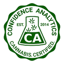

|  |
|           :---:             |
| **Confidence Analytics**    |
| 14797 NE 95th ST            | 
| Redmond, WA 98052           |
| (206) 743-8843              |
| info@conflabs.com           |
| www.conflabs.com            |

## Confidence Analytics presents:

# Eight Cannabinoids by HPLC-UV
A Method Application Note on the detection of 8 Cannabinoids using HPLC-UV.

(Originally published 2018-03-22)

Measurement of cannabinoid content, or “the potency test”, is frequently discussed in cannabis analysis. Many such 
methods have been developed in the past few years, but none have yet been rigorously validated and shown to work 
consistently with real cannabis samples of all types. Consequently, labs testing cannabis are each using different 
methods of analysis, and no standardized method has been universally adopted.

[A recent study on Scientific Reports of the Washington state I-502 dataset](https://www.nature.com/articles/s41598-018-22755-2) 
has highlighted [the need for lab standardization](https://www.conflabs.com/study-highlights-cannabis-testing-standards/). 
Consistently measuring low levels of CBD in the presence of large levels of other cannabinoids is not something that all 
labs appear capable of. In the interests of lab standardization, we are releasing our cannabinoid analysis method into 
the public domain: [Method Application Note – Eight Cannabinoids by HPLC-UV](Eight-Cannabinoids-by-HPLC-UV-v1.1.md).

In this paper, we describe the method which has been in routine use at Confidence Analytics since 2014, measuring CBDA, 
CBGA, THCA, CBG, CBD, CBN, THC (delta-9), and CBC. It has acquired data on over 50,000 cannabis consumer products in 
that time. We include example instructions for sample preparation (including our recommended means of homogenizing 
flower samples), instrument selection and performance, important considerations, and an overview of our experience 
using this method for years.

## ROBUSTNESS

This method performs excellently for all cannabis flowers and concentrates. The use of a high-organic-fraction LC pump 
program affords useful resolution between matrix components of cannabis-infused products and the target analytes for 
most sample types. Adequate sample preparation removes most lipids from vial solutions. Beverages, liquid emulsions, 
hard candies, dairy-containing candies, gummies, baked goods, cooking oils, and salty snacks are all handled deftly by 
this method. Analyte retention times are essentially unaffected by various sample matrices.

## BEYOND THE METHOD

As with anything in life, you only get back what you put in. Simply following the steps will not be sufficient to 
guarantee success. Diligence is required across all aspects of lab operations from sample intake and handling to 
processing, post-processing, quality assurance and more. We attribute much of our success to the care and attention our 
entire team takes with the samples we receive. We also pride ourselves on the customer service we deliver, regularly 
going beyond analysis to help our clients solve problems. This is how we expand robustness beyond our methods to our 
entire lab.

## MOVING FORWARD  

By agreeing to a common and transparent set of standards for cannabinoid analysis in Washington state, we can work 
towards eliminating the differences between labs that are readily apparent to everyone in the industry. By releasing 
our method into the public domain, we hope to advance the standardization conversation – who will join us?
